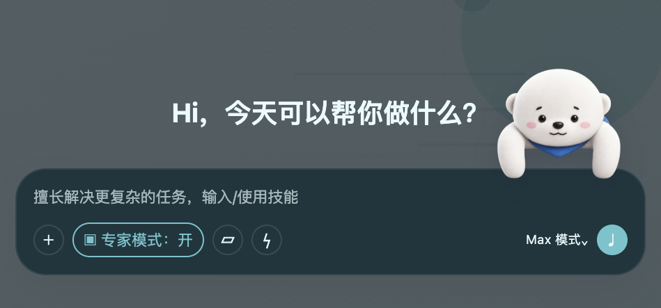
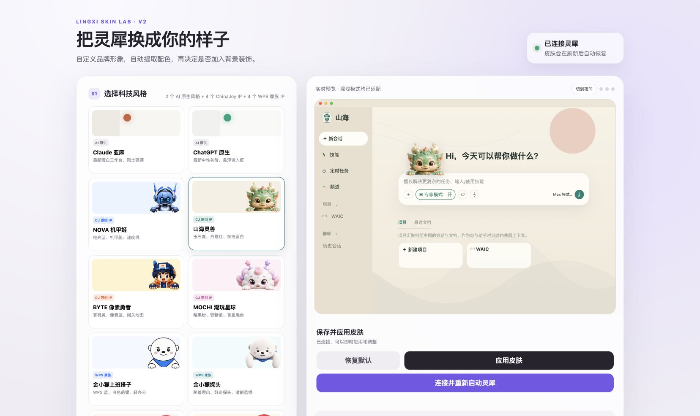

# WPS 灵犀皮肤管理器

> 每个人的办公助理，当然也可以长得不一样。

[](https://github.com/Githun1314/lingxi-skin-manager/releases/latest)
[](#系统要求)
[](LICENSE)

一个面向 macOS 版 WPS 灵犀的第三方本地皮肤管理器。它支持完整主题、品牌 Logo 与名称、日夜配色、背景画布和随输入框动态定位的 IP 挂件，同时不修改官方应用包。



## 功能

- 10 套完整预设：Claude、ChatGPT、4 套 ChinaJoy 氛围原创主题、4 套 WPS 家族演示主题。
- 日间与夜间分别配色，文字、卡片、侧栏、输入框和强调色同步适配。
- 上传自己的 Logo 或形象，并从素材中自动提取主题色。
- 同步替换侧边栏、窗口标题、启动页、欢迎区和对话状态中的 Logo 与名称。
- 可选的品牌身份记忆，让助理在自我介绍时使用自定义名称。
- 背景支持覆盖范围、裁切方式、焦点、遮罩、模糊和留白模板。
- 角色可吸附在输入框五个位置，并随窗口、侧栏和输入框尺寸动态调整。
- 一键恢复官方默认界面；可生成带自定义名称和图标的本地应用入口。



## 安装

1. 前往 [Releases](https://github.com/Githun1314/lingxi-skin-manager/releases/latest) 下载最新的 `WPS-Lingxi-Skin-Manager-*-macOS.zip`。
2. 解压后双击 `WPS灵犀皮肤管理器.app`。
3. 第一次使用时点击“连接并重新启动灵犀”。
4. 选择主题并点击“应用皮肤”。

系统可能提示该应用来自未识别的开发者。这是因为当前分享包使用本地临时签名，没有申请 Apple Developer 公证。请仅从本仓库 Releases 下载，并在确认来源后运行。

## 系统要求

- macOS，Apple Silicon 已验证。
- 已安装 WPS 灵犀专业版。
- 当前仅测试 macOS；Windows 尚未适配。

## 工作方式

管理器以本地方式为灵犀界面应用主题样式和品牌信息，不修改官方应用文件。皮肤配置和上传素材仅保存在本机。

主题配置保存在：

```text
~/Library/Application Support/Lingxi Skin Manager/theme.json
```

如果灵犀后续大幅调整在线界面结构，部分样式选择器可能需要跟随更新。

## 本地开发

```bash
npm run check
npm start
```

打开 `http://localhost:17363`。构建 macOS 分享包：

```bash
./scripts/build-macos.sh
```

## 主题设计说明

- 推荐背景画布为 `1920 × 1200`。
- 中央阅读区域和底部输入区应保持低细节。
- 主要视觉元素建议放在右上角或页面两侧。
- 趴框素材应使用透明 PNG，并让手部或前臂与统一的水平基线对齐。
- Logo 建议使用透明、无外描边的方形素材，以适配客户端圆形头像容器。

## 隐私与安全

- 所有服务仅在本机运行，不向局域网或公网开放。
- 不接受用户输入的任意 CSS，只应用管理器生成的受控样式。
- 恢复默认只删除管理器创建的品牌身份记忆，不会修改其他个人记忆。
- 仓库不包含任何用户主题配置、历史会话或本机个人数据。

## 参与项目

欢迎通过 [Issues](https://github.com/Githun1314/lingxi-skin-manager/issues) 提交适配问题、主题建议和新的客户端界面变化。提交前请阅读 [CONTRIBUTING.md](CONTRIBUTING.md)。

## 项目故事

完整的开发过程记录在 WPS 社区：

[民间版「灵犀皮肤管理器」来了！每个人的办公助理，当然也该长得不一样](https://bbs.wps.cn/topic/92811)

## 声明

本项目是非官方第三方实验项目，与金山办公、WPS 官方团队不存在隶属或授权关系。“WPS”“灵犀”及相关角色、名称和标识的权利归其各自权利人所有。仓库中的演示主题仅用于技术研究与界面个性化展示，请勿将相关品牌或角色素材用于未经授权的商业用途。

代码采用 [MIT License](LICENSE)。视觉和品牌素材的使用边界见 [ASSETS_LICENSE.md](ASSETS_LICENSE.md)。
